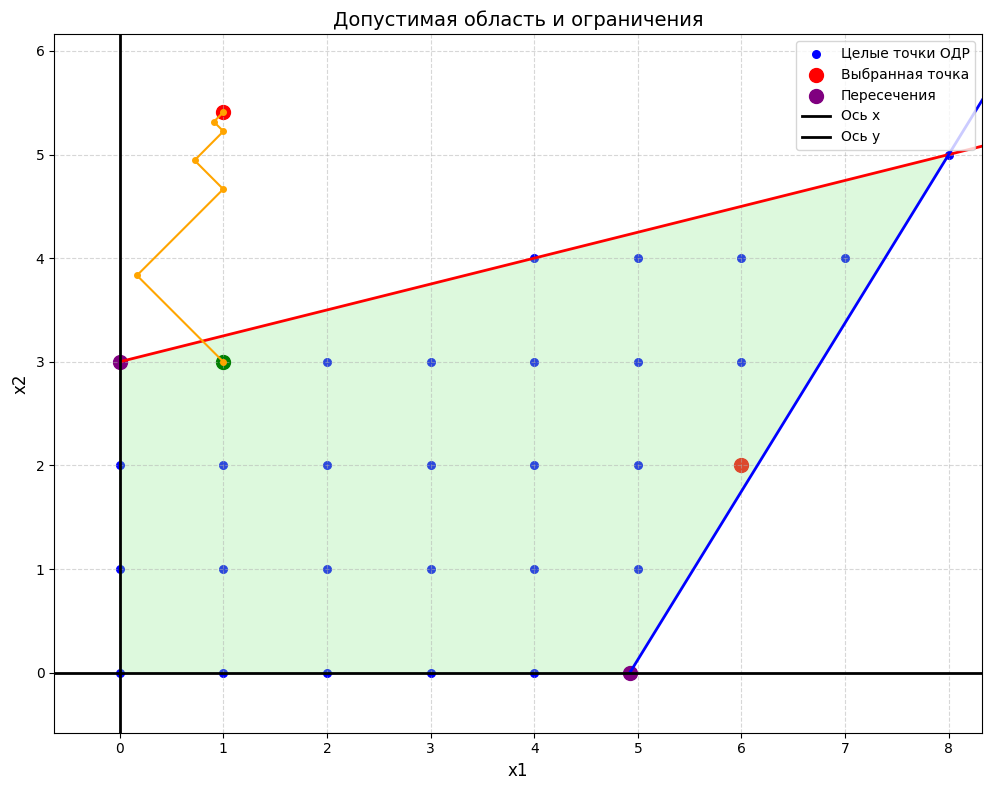

# Optimization with Gradient Descent


Проект реализует метод градиентного спуска для задачи условной оптимизации с визуализацией.

## 📦 Установка

```bash
git clone https://github.com/gshjis/MOTStask1.git
cd MOTStask1
pip install -r requirements.txt
```

## 📝 Требования
- Python 3.8+
- Установленные зависимости:
  ```bash
  numpy sympy matplotlib pydantic
  ```

## 🚀 Быстрый старт
1. Запустите программу:
```bash
python main.py
```

2. Пример ввода в `main()`:
```python
# Коэффициенты целевой функции (ax₁² + bx₂² + cx₁x₂ + dx₁ + ex₂)
'Enter f indexes: 3 1 -2 5 -9'  

# Коэффициенты ограничений (a₁x₁ + b₁x₂ + c₁ ≤ 0)
'Enter g1 indexes: -1 4 -12'
'Enter g2 indexes: 13 -8 -64'
```

## 📊 Визуализация
Программа генерирует график:

1. **Допустимая область и траектория**
   


# 📄 Пример вывода
```text
Найти минимум функции
F(x) =  3.0*x1**2 - 2.0*x1*x2 + 5.0*x1 + 1.0*x2**2 - 9.0*x2
g1 =  -1.0*x1 + 4.0*x2 - 12.0
g2 =  13.0*x1 - 8.0*x2 - 64.0
H =  [[ 6. -2.]
 [-2.  2.]]
H^-1 =  [[0.25 0.25]
 [0.25 0.75]]


Метод ньютона
==================================================

x* =  [4 3]  -  [[0.25 0.25]
 [0.25 0.75]]  *  [ 23. -11.]
x* =  [1.  5.5]
==================================================

Градиентный спуск

==================================================
Детализация шагов градиентного спуска
==================================================

Шаг 1:
Текущая точка (x_k): [4 3]
Градиент в точке (grad_x_k): [ 23. -11.]
Следующая точка через alpha (x_k1_a_): [23.0*a + 4 3 - 11.0*a]
Градиент через alpha (grad_a_): [160.0*a + 23.0 -68.0*a - 11.0]
Скалярное произведение градиентов: 4428.0*a + 650.0
Оптимальное alpha: -0.146793134598013
Новая точка (x_k1): [0.623757904245709 4.61472448057814]
--------------------------------------------------

Шаг 2:
Текущая точка (x_k): [0.623757904245709 4.61472448057814]
Градиент в точке (grad_x_k): [-0.4869  -1.01807]
Следующая точка через alpha (x_k1_a_): [0.624 - 0.487*a 4.615 - 1.018*a]
Градиент через alpha (grad_a_): [-0.886*a - 0.486 -1.062*a - 1.018]
Скалярное произведение градиентов: 1.513*a + 1.273
Оптимальное alpha: -0.841641433885799
Новая точка (x_k1): [1.03355441089833 5.47157172176088]
--------------------------------------------------

Шаг 3:
Текущая точка (x_k): [1.03355441089833 5.47157172176088]
Градиент в точке (grad_x_k): [ 0.25818 -0.12397]
Следующая точка через alpha (x_k1_a_): [0.258*a + 1.034 5.472 - 0.124*a]
Градиент через alpha (grad_a_): [1.796*a + 0.26 -0.764*a - 0.124]
Скалярное произведение градиентов: 0.558*a + 0.083
Оптимальное alpha: -0.147741966601367
Новая точка (x_k1): [0.995409943504435 5.48988661053770]
--------------------------------------------------

Шаг 4:
Текущая точка (x_k): [0.995409943504435 5.48988661053770]
Градиент в точке (grad_x_k): [-0.00731 -0.01105]
Следующая точка через alpha (x_k1_a_): [0.995 - 0.007*a 5.49 - 0.011*a]
Градиент через alpha (grad_a_): [-0.02*a - 0.01 -0.008*a - 0.01]
Скалярное произведение градиентов: 0.0
Оптимальное alpha: -0.780226650949830
Новая точка (x_k1): [1.00111617796781 5.49850551370314]
--------------------------------------------------

Шаг 5:
Текущая точка (x_k): [1.00111617796781 5.49850551370314]
Градиент в точке (grad_x_k): [ 0.00969 -0.00522]
Следующая точка через alpha (x_k1_a_): [0.01*a + 1.001 5.499 - 0.005*a]
Градиент через alpha (grad_a_): [0.07*a + 0.008 -0.03*a - 0.004]
Скалярное произведение градиентов: 0.001*a
Оптимальное alpha: -0.118769748300198
Новая точка (x_k1): [0.999965769387408 5.49912564957836]
--------------------------------------------------
```

